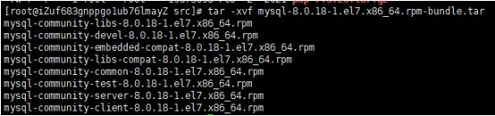

# LNMP+Redis 环境搭建记录
### centos7.6 + nginx1.8.1 + mysql8 + php7.3.6 + redis
---
### 一、准备环境、安装依赖库
1. 安装pcre
   ```
   wget http://downloads.sourceforge.net/project/pcre/pcre/8.35/pcre-8.35.tar.gz
   tar zxvf pcre-8.35.tar.gz
   cd pcre-8.35
   ./configure
   make && make install
   ```
2. 安装gcc-c++
   ```
   yum -y install gcc-c++
   ```
---
### 二、nginx安装
1. 下载nginx安装包、解压、编译安装
   ```
   wget http://nginx.org/download/nginx-1.8.1.tar.gz
   tar -zxvf nginx-1.8.1.tar.gz
   cd nginx-1.8.1

   ## 配置安装目录、模块、运行用户、直播推流模块(下载好指定目录)
   ./configure --prefix=/usr/local/nginx --with-http_ssl_module --with-http_realip_module --with-http_addition_module --with-http_sub_module --with-http_dav_module --with-http_flv_module --with-http_mp4_module --with-http_gunzip_module --with-http_gzip_static_module --with-http_auth_request_module --with-http_random_index_module --with-http_secure_link_module --with-http_degradation_module --with-http_stub_status_module --with-mail --with-mail_ssl_module --user=www --group=www --add-module=/usr/local/java/nginx-rtmp/nginx-http-flv-module-1.2.8

   make
   make install
   ```
2. 添加环境变量
   ```
   cp /usr/local/nginx/sbin/nginx /usr/sbin/
   ```
3. 启动环境
   ```
   /usr/local/nginx/sbin/nginx 
   ``` 
4. [可选]添加开机运行nginx
   >进入目录并创建nginx.service
   ```
   cd /lib/systemd/system/
   vim nginx.service
   ```
   >编辑nginx.service
   ```
   [Unit]
   Description=nginx service
   After=network.target 
    
   [Service] 
   Type=forking 
   ExecStart=/usr/local/nginx/sbin/nginx
   ExecReload=/usr/local/nginx/sbin/nginx -s reload
   ExecStop=/usr/local/nginx/sbin/nginx -s quit
   PrivateTmp=true 
    
   [Install] 
   WantedBy=multi-user.target
   ```
   >加入开机启动服务
   ```
   systemctl enable nginx
   ```
   >相关命令查看参考[参考文献](https://www.cnblogs.com/jepson6669/p/9131217.html)
   ```
   systemctl start nginx.service　         启动nginx服务
   systemctl stop nginx.service　          停止服务
   systemctl restart nginx.service　       重新启动服务
   systemctl list-units --type=service     查看所有已启动的服务
   systemctl status nginx.service          查看服务当前状态
   systemctl enable nginx.service          设置开机自启动
   systemctl disable nginx.service         停止开机自启动
   ```

---
### Mysql8 安装
1. 检查当前环境是否自带mysql
   ```
   rqm -qa | grep mysql 
   ```   
2. 下载安装包解压
   ```
   wget https://cdn.mysql.com/archives/mysql-8.0/mysql-8.0.18-1.el7.x86_64.rpm-bundle.tar
   tar -xvf mysql-8.0.18-1.el7.x86_64.rpm-bundle.tar
   ```
   
3. rpm -qa | grep mariadb 命令查看 mariadb 的安装包5; 卸载mariadb
   ```
   rpm -e mariadb-libs-5.5.68-1.el7.x86_64 --nodeps 
   ```
4. 依次安装如下安装包
   ```
   rpm -ivh mysql-community-common-8.0.18-1.el7.x86_64.rpm
   rpm -ivh mysql-community-libs-8.0.18-1.el7.x86_64.rpm
   rpm -ivh mysql-community-client-8.0.18-1.el7.x86_64.rpm
   rpm -ivh mysql-community-server-8.0.18-1.el7.x86_64.rpm
   ```
5. 配置
   ```
   mysqld --initialize 初始化
   chown mysql:mysql /var/lib/mysql -R 授权
   systemctl start mysqld 开启mysql服务
   systemctl status mysqld 查看mysql 状态 

   # 密码重置
   cat /var/log/mysqld.log | grep password 查看root初始密码

   mysql -u root -p #回车之后输入前面的初始密码

   # 命令设置自己的密码
   ALTER USER "root"@"localhost" IDENTIFIED BY "自己的密码";

   # 立即生效
   FLUSH PRIVILEGES; 
   ```

   
6. 配置远程连接（生产环境原则不允许，如果连的一定要做好权限设置）
   ```
   use mysql;
   update user set host = '%' where user ='root'; 
   ALTER USER 'root'@'%' IDENTIFIED BY 'password' PASSWORD EXPIRE NEVER;  

   # 更改加密方式
   ALTER USER 'root'@'%' IDENTIFIED WITH mysql_native_password BY '自己的密码'; #更新用户密码 （我这里为root ）
   ```
---

   

