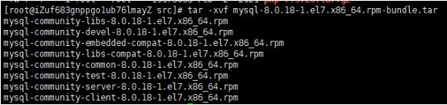
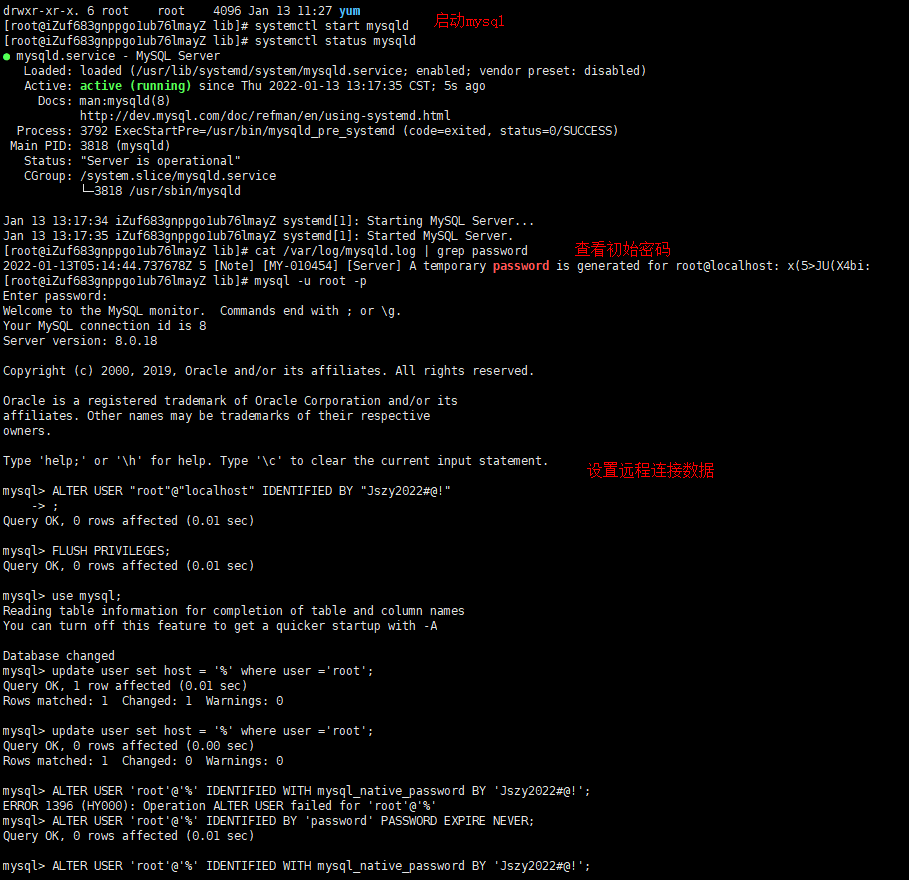
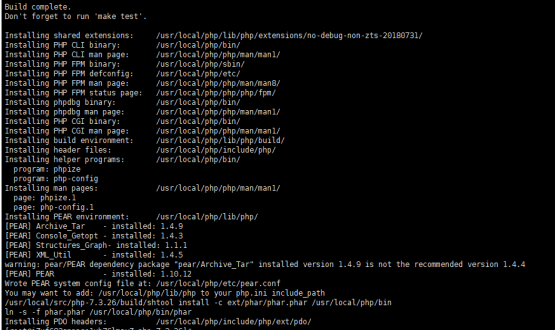

# LNMP+Redis 环境搭建记录
### centos7.6 + nginx1.8.1 + mysql8 + php7.3.6 + redis
---
### 一、准备环境、安装依赖库
1. 安装pcre
   ```
   wget http://downloads.sourceforge.net/project/pcre/pcre/8.35/pcre-8.35.tar.gz
   tar zxvf pcre-8.35.tar.gz
   cd pcre-8.35
   ./configure
   make && make install
   ```
2. 安装gcc-c++
   ```
   yum -y install gcc-c++
   ```
3. 安装gcc
   ```
   yum install -y gcc
   ```
---
### 二、nginx安装
1. 下载nginx安装包、解压、编译安装
   ```
   wget http://nginx.org/download/nginx-1.8.1.tar.gz
   tar -zxvf nginx-1.8.1.tar.gz
   cd nginx-1.8.1

   ## 配置安装目录、模块、运行用户、直播推流模块(下载好指定目录)
   ./configure --prefix=/usr/local/nginx --with-http_ssl_module --with-http_realip_module --with-http_addition_module --with-http_sub_module --with-http_dav_module --with-http_flv_module --with-http_mp4_module --with-http_gunzip_module --with-http_gzip_static_module --with-http_auth_request_module --with-http_random_index_module --with-http_secure_link_module --with-http_degradation_module --with-http_stub_status_module --with-mail --with-mail_ssl_module --user=www --group=www --add-module=/usr/local/java/nginx-rtmp/nginx-http-flv-module-1.2.8

   make
   make install
   ```
2. 添加环境变量
   ```
   cp /usr/local/nginx/sbin/nginx /usr/sbin/
   ```
3. 启动环境
   ```
   /usr/local/nginx/sbin/nginx 
   ``` 
4. [可选]添加开机运行nginx
   >进入目录并创建nginx.service
   ```
   cd /lib/systemd/system/
   vim nginx.service
   ```
   >编辑nginx.service
   ```
   [Unit]
   Description=nginx service
   After=network.target 
    
   [Service] 
   Type=forking 
   ExecStart=/usr/local/nginx/sbin/nginx
   ExecReload=/usr/local/nginx/sbin/nginx -s reload
   ExecStop=/usr/local/nginx/sbin/nginx -s quit
   PrivateTmp=true 
    
   [Install] 
   WantedBy=multi-user.target
   ```
   >加入开机启动服务
   ```
   systemctl enable nginx
   ```
   >相关命令查看参考[参考文献](https://www.cnblogs.com/jepson6669/p/9131217.html)
   ```
   systemctl start nginx.service　         启动nginx服务
   systemctl stop nginx.service　          停止服务
   systemctl restart nginx.service　       重新启动服务
   systemctl list-units --type=service     查看所有已启动的服务
   systemctl status nginx.service          查看服务当前状态
   systemctl enable nginx.service          设置开机自启动
   systemctl disable nginx.service         停止开机自启动
   ```

---
### 三、Mysql8 安装
1. 检查当前环境是否自带mysql
   ```
   rqm -qa | grep mysql 
   ```   
2. 下载安装包解压
   ```
   wget https://cdn.mysql.com/archives/mysql-8.0/mysql-8.0.18-1.el7.x86_64.rpm-bundle.tar
   tar -xvf mysql-8.0.18-1.el7.x86_64.rpm-bundle.tar
   ```
   
3. rpm -qa | grep mariadb 命令查看 mariadb 的安装包5; 卸载mariadb
   ```
   rpm -e mariadb-libs-5.5.68-1.el7.x86_64 --nodeps 
   ```
4. 依次安装如下安装包
   ```
   rpm -ivh mysql-community-common-8.0.18-1.el7.x86_64.rpm
   rpm -ivh mysql-community-libs-8.0.18-1.el7.x86_64.rpm
   rpm -ivh mysql-community-client-8.0.18-1.el7.x86_64.rpm
   rpm -ivh mysql-community-server-8.0.18-1.el7.x86_64.rpm
   ```
5. 配置
   ```
   mysqld --initialize 初始化
   chown mysql:mysql /var/lib/mysql -R 授权
   systemctl start mysqld 开启mysql服务
   systemctl status mysqld 查看mysql 状态 

   # 密码重置
   cat /var/log/mysqld.log | grep password 查看root初始密码

   mysql -u root -p #回车之后输入前面的初始密码

   # 命令设置自己的密码
   ALTER USER "root"@"localhost" IDENTIFIED BY "自己的密码";

   # 立即生效
   FLUSH PRIVILEGES; 
   ```
   
6. 配置远程连接（生产环境原则不允许，如果连的一定要做好权限设置）
   ```
   use mysql;
   update user set host = '%' where user ='root'; 
   ALTER USER 'root'@'%' IDENTIFIED BY 'password' PASSWORD EXPIRE NEVER;  

   # 更改加密方式
   ALTER USER 'root'@'%' IDENTIFIED WITH mysql_native_password BY '自己的密码'; #更新用户密码 （我这里为root ）
   ```
---
### 四、PHP安装部署
1. 下载php安装包、解压
   ```
   wget https://www.php.net/distributions/php-7.3.26.tar.gz 

   tar -zxvf php-7.3.26
   cd php-7.3.26
   ```
2. 配置,配置安装目录，运行账号，模块
   ```
   ./configure --prefix=/usr/local/php --with-fpm-user=nginx --with-fpm-group=nginx --with-curl --with-freetype-dir --with-gd --with-gettext --with-iconv-dir --with-kerberos --with-libdir=lib64 --with-libxml-dir --with-mysqli --with-openssl --with-pcre-regex --with-pdo-mysql --with-pdo-sqlite --with-pear --with-png-dir --with-jpeg-dir --with-xmlrpc --with-xsl --with-zlib --with-bz2 --with-mhash --enable-fpm --enable-bcmath --enable-libxml --enable-inline-optimization --enable-mbregex --enable-mbstring --enable-opcache --enable-pcntl --enable-shmop --enable-soap --enable-sockets --enable-sysvsem --enable-sysvshm --enable-xml --enable-zip --enable-fpm
   ```
3. 编辑和安装
   ```
   make && make install 
   ``` 
   
4. 配置php
   ```
   # php配置文件
   cp php.ini-production /usr/local/php/lib/php.ini

   # php-fpm
   cp /usr/local/php/etc/php-fpm.conf.default /usr/local/php/etc/php-fpm.conf
   ln -s /usr/local/php/sbin/php-fpm /usr/local/bin
   cd /usr/local/php/etc/php-fpm.d
   # 备份
   cp www.conf www.conf.bak
   # 修改配置（特别申明：用户和用户组必须和php相关运行代码目录权限一直）
   user = nginx  # 假设项目目录权限用户为nginx
   group = nginx 
   ```
5. 加入systemctl服务
   ```
   cd /usr/local/src/php-7.3.26/sapi/fpm/ 
   cp php-fpm.service /usr/lib/systemd/system/
   ```
6. 启动
   ```
   systemctl start php-fpm 
   ```
7. 设置全局变量(通过软连接)
   ```
   ln -s /usr/local/php/bin/php /usr/local/bin 
   ```
8. 开机启动
   ```
   vim /etc/systemd/system/php-fpm.service
   ```
   >修改php-fpm.service
   ```
   [Unit]
   Description=The PHP FastCGI Process Manager
   After=syslog.target network.target

   [Service]
   Type=simple
   PIDFile=/run/php-fpm.pid
   ExecStart=/usr/local/php7/sbin/php-fpm --nodaemonize --fpm-config /usr/local/php7/etc/php-fpm.conf
   ExecReload=/bin/kill -USR2 $MAINPID
   ExecStop=/bin/kill -SIGINT $MAINPID

   [Install]
   WantedBy=multi-user.target
   ```
   >启动php服务
   ```
   systemctl start php-fpm.service
   ```
   >php加入开机服务
   ```
   systemctl enable php-fpm.service
   ```
   >php相关命令参考[php命令](https://www.cnblogs.com/onephp/p/6093707.html)
   ```
   systemctl enable *.service #开机运行服务
   systemctl disable *.service #取消开机运行
   systemctl start *.service #启动服务
   systemctl stop *.service #停止服务
   systemctl restart *.service #重启服务
   systemctl reload *.service #重新加载服务配置文件
   systemctl status *.service #查询服务运行状态
   systemctl --failed #显示启动失败的服务
   ```
   >php-fpm日志等信息可以在/usr/local/php/etc/php-fpm.conf
---
### 五、Redis 安装
1. 下载redis安装包、解压、编译
   ```
   wget https://download.redis.io/releases/redis-6.2.6.tar.gz 

   tar -zxvf redis-6.2.6.tar.gz
   cd redis-6.2.6
   make
   ```
2. 配置和安装
   ```
   make install PREFIX=/usr/local/redis
   ```
3. 启动redis
   >前台启动
   ```
   cd /usr/local/redis/bin/
   ./redis-server 
   ```
   >后台启动,从 redis 的源码目录中复制 redis.conf 到 redis 的安装目录
   ```
   cp /usr/local/redis-5.0.3/redis.conf /usr/local/redis/bin/
   vi redis.conf
   ```
   修改 redis.conf 文件，把 daemonize no 改为 daemonize yes
   
   启动后台服务
   ```
   ./redis-server redis.conf
   ```
4. 添加开机启动服务
   ```
   vi /etc/systemd/system/redis.service
   ```
   添加
   ```
   [Unit]
   Description=redis-server
   After=network.target
   [Service]
   Type=forking
   ExecStart=/usr/local/redis/bin/redis-server /usr/local/redis/bin/redis.conf
   PrivateTmp=true
   [Install]
   WantedBy=multi-user.target
   ```
   添加开机服务
   ```
   systemctl daemon-reload
   systemctl start redis.service
   systemctl enable redis.service 
   ```
5. 设置全局变量（建立软连接）
   ```
   ln -s /usr/local/redis/bin/redis-cli /usr/bin/redis 
   ```
6. redis扩展安装
   
   将redis.so 复制到/usr/local/php/lib/php/extensions/no-debug-non-zts-20180731

   开启php.ini的相关配置
   
   重启php服务


---
## 附：报错情况汇总
---
>Pcre 安装 
1. ./configure报错
   configure: error: You need a C++ compiler for C++ support
   
   解决：yum -y install gcc-c++
> nginx安装错误
2. ./configure: error: SSL modules require the OpenSSL library
   
   解决：yum -y install openssl openssl-devel
>php安装 
3. configure: error: libxml2 not found. Please check your libxml2 installation
   
    解决：yum install -y  libxml2-devel

4. configure: error: Please reinstall the BZip2 distribution
   
    解决： yum install -y  bzip2-devel
5. checking for cURL 7.15.5 or greater... configure: error: cURL version 7.15.5 or later is required to compile php with cURL support 
    
    解决：yum install -y  curl-devel
6. configure: error: jpeglib.h not found
   
    解决：yum install -y  libjpeg-devel

7. configure: error: png.h not found
   
    解决：yum install -y libpng-devel

8. configure: error: freetype-config not found
   
    解决：yum install -y freetype-devel

9.  configure: error: xslt-config not found. Please reinstall the libxslt >= 1.1.0 distribution
    
    解决：yum install -y libxslt-devel

10. configure: error: Please reinstall the libzip distribution

    解决： yum install -y libzip-devel

11. checking for libzip... configure: error: system libzip must be upgraded to version >= 0.11

    解决： 
    ```
    yum remove -y libzip
    
    #下载编译安装
    wget https://nih.at/libzip/libzip-1.2.0.tar.gz
    tar -zxvf libzip-1.2.0.tar.gz
    cd libzip-1.2.0
    ./configure
    make && make install
    ``` 
    >如果报错：configure: error: off_t undefined; check your library configuration
    解决：
    ```
    #添加搜索路径到配置文件
    echo '/usr/local/lib64
    /usr/local/lib
    /usr/lib
    /usr/lib64'>>/etc/ld.so.conf
    #然后 更新配置
    ldconfig -vndefined; check your library configuration
    ```
  >如果报错：

    ```
    /usr/local/include/zip.h:59:21: fatal error: zipconf.h: No such file or directory
        #include <zipconf.h>
                            ^
        compilation terminated.
        make: *** [ext/zip/php_zip.lo] Error 1
    ```

    解决：cp /usr/local/lib/libzip/include/zipconf.h /usr/local/include/zipconf.h

> Mysql报错
1. error: Failed dependencies:
	libaio.so.1()(64bit) is needed by mysql-community-server-8.0.18-1.el7.x86_64

    解决：yum -y install libaio

   

